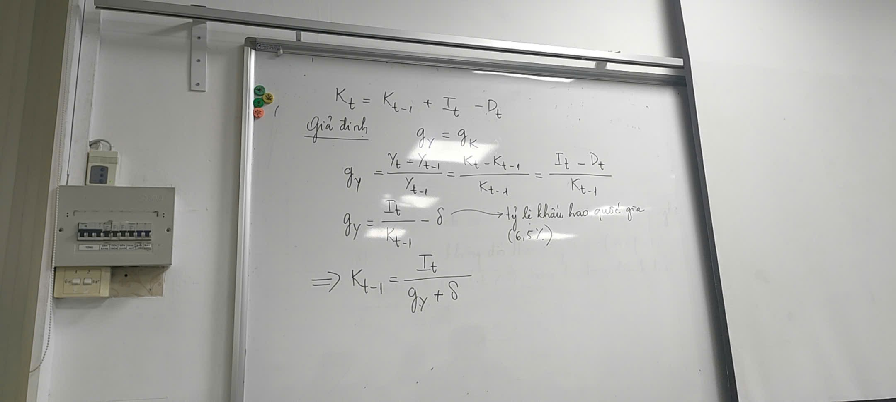
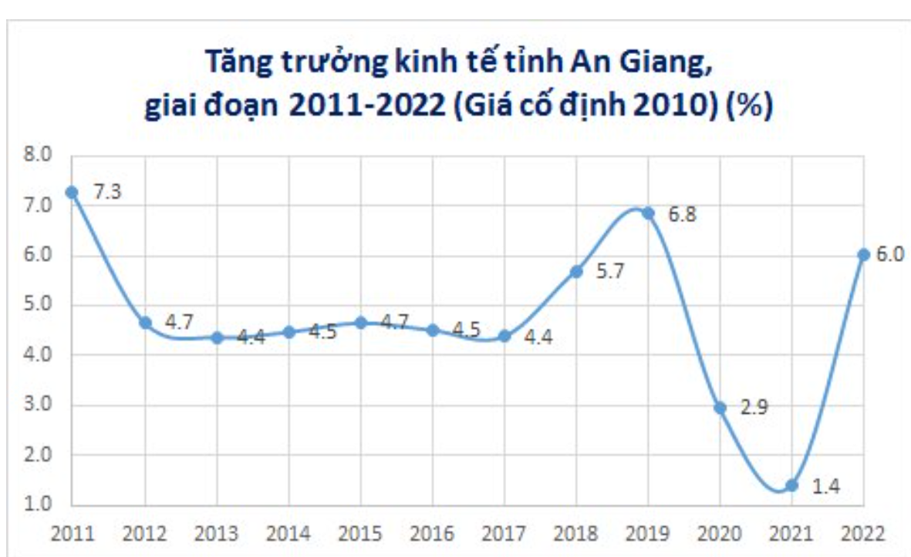
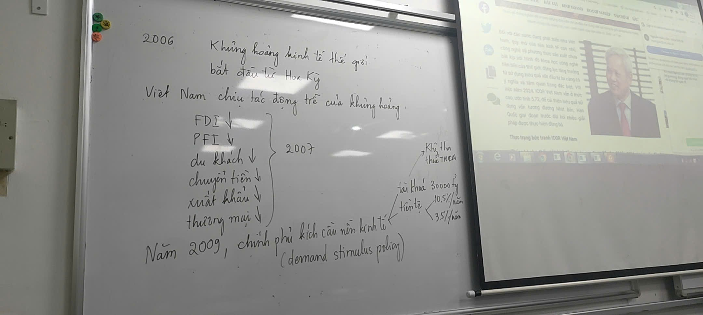

Nguyên lý 7: Đáp ứng tiêu chuẩn quốc tế về hàng hóa & dịch vụ
Xa xưa, ta học để làm quan. Nay, ta học để… xuất khẩu.

Trung bình số học 
Trung bình hình học

Trung bình số học & Trung bình hình học trong đo lường tăng trưởng
Khi phân tích các chỉ số kinh tế – thương mại quốc tế, cách tính trung bình rất quan trọng.
Cần phân biệt rõ:

Số tuyệt đối (absolute numbers) như GDP, tổng giá trị xuất khẩu, vốn đầu tư → dùng Trung bình số học.

Số tương đối (tỷ lệ % thay đổi) như tăng trưởng GDP, tăng trưởng xuất khẩu, lãi suất, lạm phát → dùng Trung bình hình học (Geometric Mean).

Công thức Trung bình hình học cho tăng trưởng bình quân
Nếu có số liệu tăng trưởng qua 
𝑘
k năm: 
𝑔
1
,
𝑔
2
,
…
,
𝑔
𝑘
g 
1
​
 ,g 
2
​
 ,…,g 
k
​
  (tính theo %), thì:

𝑔
𝑇
𝐵
=
[
(
∏
𝑖
=
1
𝑘
(
1
+
𝑔
𝑖
100
)
)
1
𝑘
−
1
]
×
100
g 
TB
​
 = 
​
 ( 
i=1
∏
k
​
 (1+ 
100
g 
i
​
 
​
 )) 
k
1
​
 
 −1 
​
 ×100
Ví dụ minh họa
Ví dụ 1 – An Giang (2011–2022)
Nguồn: Tổng cục Thống kê Việt Nam (2024)

Tính tăng trưởng bình quân:

𝑔
𝑇
𝐵
=
[
(
1
+
7.3
%
)
×
(
1
+
4.7
%
)
×
⋯
×
(
1
+
6.0
%
)
]
1
/
12
−
1
g 
TB
​
 =[(1+7.3%)×(1+4.7%)×⋯×(1+6.0%)] 
1/12
 −1
𝑔
𝑇
𝐵
≈
4.76
%
g 
TB
​
 ≈4.76%
Ví dụ 2 – Bạc Liêu (2011–2022)
Vấn đề: Năm 2020, Bạc Liêu có tăng trưởng -1.11% (âm).
Công thức Trung bình hình học vẫn áp dụng được, miễn là tổng trong ngoặc dương.

𝑔
𝑇
𝐵
=
[
(
1
+
5.2
%
)
×
(
1
+
5.0
%
)
×
⋯
×
(
1
−
1.1
%
)
×
(
1
+
5.0
%
)
×
(
1
+
9.6
%
)
]
1
/
12
−
1
g 
TB
​
 =[(1+5.2%)×(1+5.0%)×⋯×(1−1.1%)×(1+5.0%)×(1+9.6%)] 
1/12
 −1
𝑔
𝑇
𝐵
≈
5.89
%
g 
TB
​
 ≈5.89%
Kết luận quan trọng
Khi tính trung bình của các tỷ lệ % (tăng trưởng kinh tế, lãi suất, tỷ giá, chỉ số tài chính), luôn dùng Trung bình hình học.

Khi độ biến động (phương sai) của chuỗi dữ liệu lớn, cả trung bình số học và hình học đều mất dần ý nghĩa → cần phân tích sâu hơn, không chỉ dựa vào một con số trung bình.

📌 Ghi nhớ: Trong phân tích kinh tế – thương mại quốc tế, chọn đúng phương pháp tính trung bình là bước nhỏ nhưng quyết định tính chính xác của cả báo cáo.
Một sai sót ở đây có thể khiến doanh nghiệp đánh giá sai tiềm năng xuất khẩu hoặc mục tiêu tăng trưởng.

2)Phát triển kinh tế: 

1.Thu nhập,tiêu dùng(thực phẩm,y tế,giáo dục)
2.Lòng tự trọng,chân giá trị
3.Tự do lựa chọn