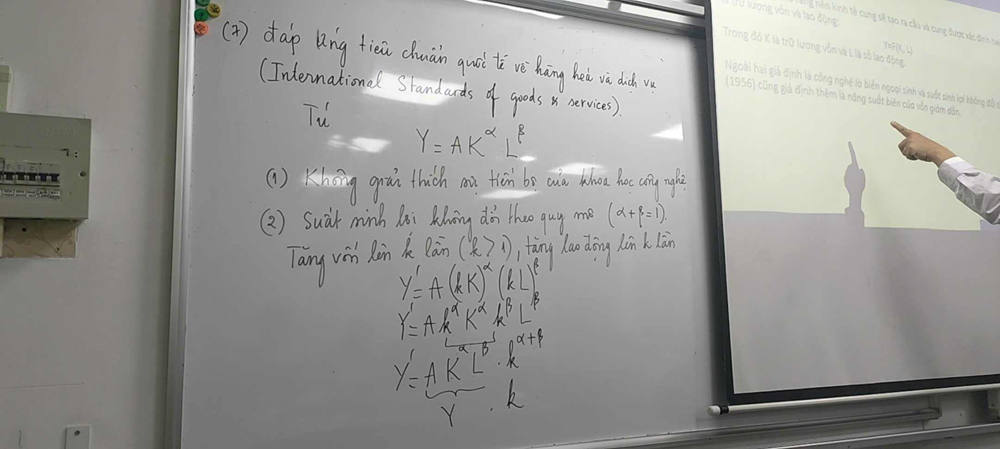

10 nguyên lý Xuất khẩu
(Nguyên lý 7)Đáp ứng tiêu chuẩn quốc tế về hàng hóa và dịch vụ (International Standards of goods & services)

Xa xưa ta chỉ học để làm quan, nay học để xuất khẩu.

Trung bình số học 
Trung bình hình học

Tính tăng trưởng bình quân như thế

nào?
Nguyễn Hoàng Bảo
Khoa Kinh tế, CELG, UEH
hoangbao@ueh.edu.vn

Nếu là con số tuyệt đối, chẳng hạn như GDP, đầu tư, xuất khẩu,... thì sử
dụng trung bình số học là đúng. Nhưng là con số tương đối, chẳng hạn
như tăng trưởng kinh tế, tăng trưởng xuất khẩu, tăng trưởng tiêu dùng, lãi
suất, ... thì sử dụng trung bình hình học (geometric mean).
Giả sử có số liệu tăng trưởng kinh tế trong k năm, tăng trưởng kinh tế
trung bình trong k năm là:

g TB = [((1+g1/100)*(1+g2/100)*…*(1+gk/100))^(1/k) -1]*100

Ví dụ 1: Có số liệu tăng trưởng kinh tế tỉnh An Giang giai đoạn 2011-2022
như hình vẽ (Tổng Cục Thống Kê Việt Nam, 2024). Câu hỏi đơn giản là
tính tăng trưởng bình quân cho cả giai đoạn 2011-2022?

g TB = [((1+7.3/100)*(1+(4.7/100)*…*(1+6.0/100))^(1/12) – 1]*100 = 4.76%
Ví dụ 2: Có số liệu tăng trưởng kinh tế tỉnh Bạc Liêu giai đoạn 2011-2022
như hình vẽ (Tổng Cục Thống Kê Việt Nam, 2024). Câu hỏi đơn giản là
tính tăng trưởng bình quân cho cả giai đoạn 2011-2022?

Vấn đề là tăng trưởng kinh tế tỉnh Bạc Liêu năm 2020 là – 1,11%. Như vậy
tính toán tăng trưởng bình quân cho cả giai đoạn bằng cách nào?
Nếu tính toán như trên, tăng trưởng trung bình hình học cho cả giai đoạn
2011-2022 ở Bạc Liêu sẽ là:

g TB = [((1+5.2/100)*(1+5.0/100)*…*(1-
1.1/100)*(1+5.0/100)*(1+9.6/100))^(1/12) – 1]*100 = 5.89%

Kết luận:
(1) Tính trung bình cho số tương đối, chẳng hạn như tỷ giá, lãi suất, chỉ số
PE trên thị trường chứng khoán, tăng trưởng kinh tế, tăng trưởng xuất
khẩu, tăng trưởng cung tiền, hay các số tương đối khác thì sử dụng
trung bình hình học;
(2) Phương sai của chuỗi số liệu càng lớn, thì trung bình số học hay trung
bình hình học đều càng mất ý nghĩa.

