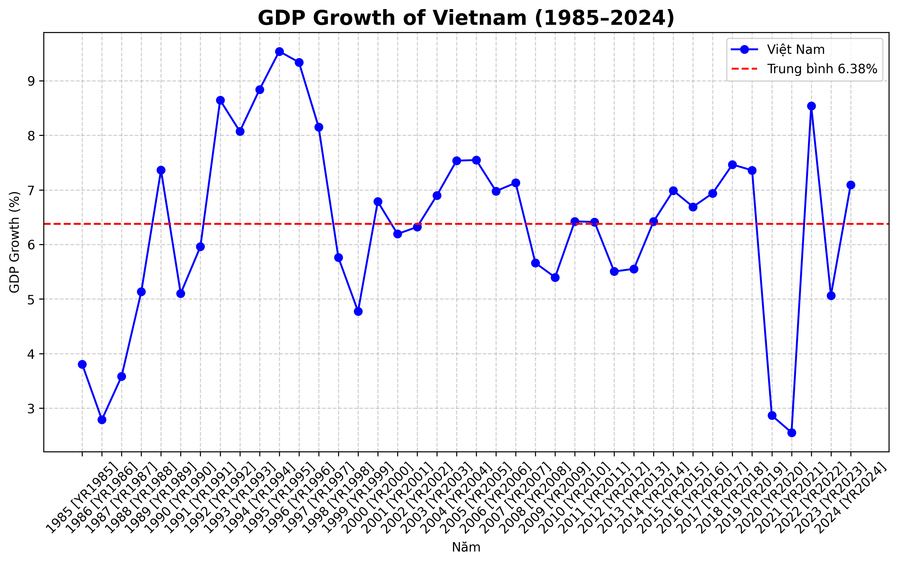
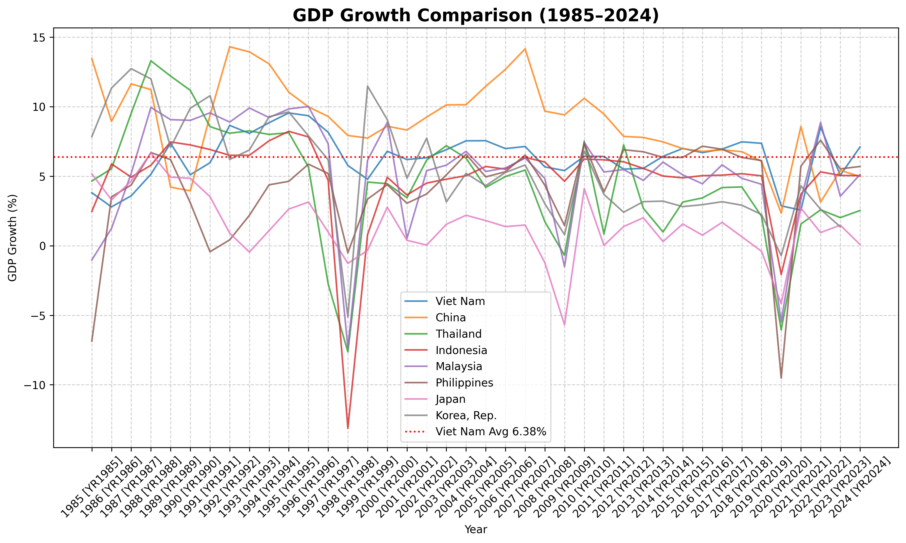

# 🌏 Phân tích tăng trưởng kinh tế (1985–2024)

Dự án này thực hiện **phân tích tăng trưởng GDP** của Việt Nam, 8 quốc gia chọn lọc và so sánh với trung bình thế giới.  
Nguồn dữ liệu được trích xuất từ **World Development Indicators (World Bank)**.

---

Mỗi thư mục bao gồm:
- **File CSV**: dữ liệu đã xử lý (tăng trưởng theo năm).
- **Biểu đồ PNG**: trực quan hóa kết quả phân tích.

---

## 🇻🇳 Kết quả cho Việt Nam

**Bình luận**:  
- Tăng trưởng GDP Việt Nam giai đoạn **1985–2024** duy trì ở mức cao so với khu vực.  
- Mặc dù có những năm biến động mạnh (ví dụ khủng hoảng tài chính châu Á 1997, khủng hoảng toàn cầu 2008, COVID-19 2020), Việt Nam vẫn giữ xu hướng **ổn định và bền vững**.  
- Trung bình giai đoạn này đạt **~7%/năm**, nằm trong nhóm nước tăng trưởng nhanh nhất thế giới.  

---

## 🌐 So sánh 8 quốc gia

**Bình luận**:  
- Nhóm 8 nước được chọn gồm: Việt Nam, Thái Lan, Indonesia, Malaysia, Philippines, Trung Quốc, Hàn Quốc, Nhật Bản.  
- **Việt Nam** nổi bật với mức tăng trưởng cao và ổn định.  
- **Trung Quốc** từng tăng trưởng rất mạnh trong thập niên 1990–2000 nhưng gần đây chậm lại.  
- **Nhật Bản** tăng trưởng chậm và có nhiều giai đoạn thấp hơn 1%, phản ánh nền kinh tế bão hòa.  

---

## 📊 Việt Nam vs Thế giới

**Bình luận**:  
- So với **trung bình thế giới**, Việt Nam duy trì tăng trưởng vượt trội.  
- Trong các giai đoạn khó khăn toàn cầu (2008, 2020), Việt Nam tuy chịu tác động nhưng **không rơi vào tăng trưởng âm sâu** như nhiều nền kinh tế khác.  
- Điều này cho thấy **sức chống chịu và khả năng phục hồi mạnh mẽ** của kinh tế Việt Nam.  

---

## ✅ Kết luận

- Việt Nam duy trì mức tăng trưởng **cao và ổn định** suốt gần 40 năm qua.  
- So với nhóm nước trong khu vực và trung bình thế giới, Việt Nam thể hiện **hiệu quả phát triển kinh tế vượt trội**.  
- Đây là minh chứng cho **thành công trong chính sách đổi mới** và hội nhập kinh tế quốc tế.  

---
✍️ *Phân tích & trực quan hóa dữ liệu kinh tế bằng Python (pandas + matplotlib).*

